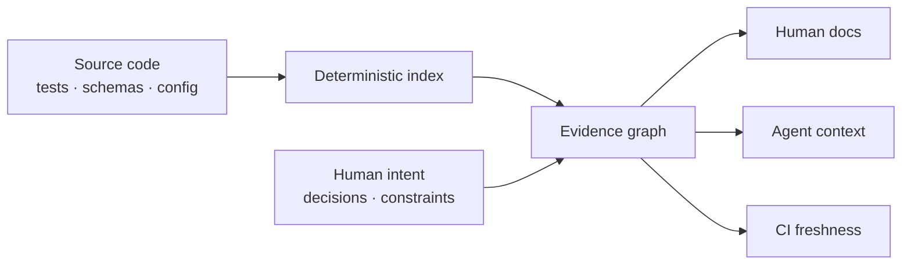

<p align="center">
  
</p>

<p align="center">
  <strong>Your codebase already knows how it works. ProDocs makes it explain itself—with receipts.</strong>
</p>

<p align="center">
  <a href="https://github.com/boyeesu/prodocs/actions/workflows/ci.yml"></a>
  <a href="https://github.com/boyeesu/prodocs/blob/main/LICENSE"></a>
  <a href="https://nodejs.org"></a>
  <a href="https://github.com/boyeesu/prodocs"></a>
</p>

<p align="center">
  <a href="#quickstart">Quickstart</a> ·
  <a href="#why-prodocs">Why ProDocs</a> ·
  <a href="#agent-native-by-default">Agents</a> ·
  <a href="https://github.com/boyeesu/prodocs/blob/main/docs/PRODUCT_VISION.md">Vision</a> ·
  <a href="https://github.com/boyeesu/prodocs/blob/main/docs/ROADMAP.md">Roadmap</a>
</p>

<p align="center">
  
</p>

---

> **Code is evidence. Documentation is a set of claims. ProDocs keeps the
> link between them.**

ProDocs is local-first documentation infrastructure for software teams and
coding agents. It deterministically indexes a repository, builds a portable
evidence graph, renders human-readable system documentation, and gives agents
the smallest relevant context for a task.

No hosted service. No model required. No repository data leaves your machine.

## Why ProDocs

Most documentation tools produce prose. ProDocs produces **traceable
knowledge**.

| Conventional documentation | ProDocs |
| --- | --- |
| Pages drift silently | CI detects source and configuration drift |
| Generated prose sounds plausible | Generated facts retain file, symbol, line, and relationship evidence |
| Every tool builds another index | Humans and agents read the same versioned graph |
| Agents ingest an entire repository | Agents request a scoped dependency neighborhood |
| AI can overwrite intent | Deterministic facts and human-authored intent stay separate |
| Knowledge lives in a vendor cloud | Everything lives and reviews with the code |

## Quickstart

ProDocs requires Node.js 20 or newer.

```bash
# Install the immutable production-ready beta
npm install --global github:boyeesu/prodocs#v0.2.0

# Inside any repository
prodocs init
prodocs sync
prodocs status
```

You now have:

```text
docs/prodocs/
├── SYSTEM_OVERVIEW.md   human system orientation
├── CODE_MAP.md          files, owners, symbols, and evidence lines
├── knowledge.json       portable, agent-readable evidence graph
└── manifest.json        freshness and configuration snapshot
```

Ask for scoped context:

```bash
prodocs context --path src/auth --json
```

The command emits a deterministic, runtime-validated context packet containing
the requested files, their one-hop dependency neighborhood, inclusion reasons,
evidence, documentation freshness, and a size/token estimate. The public
contract is [`schemas/context-packet.schema.json`](schemas/context-packet.schema.json).

Protect documentation freshness in CI:

```bash
prodocs check
```

`prodocs check` exits unsuccessfully when either indexed source or
documentation configuration has changed since the last `prodocs sync`.

## The core loop



<p align="center">
  
</p>

The current beta indexes supported source files, declarations, local imports,
inferred entrypoints, ownership, and content hashes. JavaScript and TypeScript
use a real syntax-tree parser behind a versioned collector interface. The
architecture is designed for claims, decisions, change impact, and MCP without
replacing the core graph.

## Agent-native by default

Any agent that can run a command can use ProDocs. The integration surface is a
CLI plus versioned JSON—not a dependency on one vendor.

```bash
# Minimal task context, including directly related files
prodocs context --path src/billing/invoice.ts --json

# Machine-readable repository health
prodocs status --json

# Required after code changes
prodocs sync && prodocs check
```

`prodocs init` creates opt-in integration guidance under
`.prodocs/integrations/` for:

- Codex and other tools that follow `AGENTS.md`;
- Claude Code;
- OpenCode.

Native MCP resources and task-shaped context budgets are on the
[roadmap](https://github.com/boyeesu/prodocs/blob/main/docs/ROADMAP.md).

### Context packet contract

Context packets use `schemaVersion: 1` and `kind: "prodocs.context-packet"`.
Requested paths are normalized, deduplicated, and sorted. Every included node
states whether it matched the request or was included as a direct dependency.
Packets carry current and documented hashes so an agent can distinguish fresh,
stale, and missing documentation without guessing.

`stats.contextBytes` measures the serialized request, nodes, and relationships.
`stats.estimatedTokens` is a deterministic approximation of one token per four
UTF-8 bytes; it is a budgeting hint, not a model-specific tokenizer result.

## Commands

| Command | Purpose |
| --- | --- |
| `prodocs init` | Create configuration and non-destructive agent integration guides |
| `prodocs sync` | Scan source and refresh evidence-backed artifacts |
| `prodocs context --path <path>` | Select a path and its dependency neighborhood |
| `prodocs check` | Fail when generated documentation is stale |
| `prodocs status` | Show freshness and index statistics |

All data-producing commands support `--json`. Use `--root <directory>` to
target another repository.

## Configuration

`prodocs init` creates `prodocs.config.json`:

```json
{
  "$schema": "https://raw.githubusercontent.com/boyeesu/prodocs/main/schemas/prodocs-config.schema.json",
  "schemaVersion": 1,
  "source": ["."],
  "output": "docs/prodocs",
  "include": ["**/*.js", "**/*.ts", "**/*.py", "**/*.go", "**/*.rs"],
  "exclude": [".git", "node_modules", "vendor", "dist", "build"],
  "entrypoints": ["src/server.ts", "src/cli.ts"],
  "ownership": {
    "src/billing/": "@payments",
    "src/auth/": "@identity"
  },
  "limits": {
    "maxFiles": 50000,
    "maxFileSizeBytes": 10485760,
    "maxTotalBytes": 1073741824
  },
  "documentation": {
    "productName": "Acme",
    "oneLineDescription": "What Acme does in one sentence.",
    "audiences": ["engineers", "support", "coding-agents"]
  }
}
```

Configured sources and generated output are constrained to the selected project
root. ProDocs never executes indexed source, follows source symlinks, or writes
through generated-file symlinks. File-count and byte limits bound untrusted
repository resource consumption.

## Supported languages

The beta recognizes:

`JavaScript` · `TypeScript` · `Python` · `Go` · `Rust` · `Java` · `Ruby` ·
`PHP` · `C#` · `Swift` · `Kotlin`

JavaScript and TypeScript—including JSX, TSX, ESM, and CommonJS module
extensions—use parser-backed collection with conformance fixtures. It records
declarations, class/interface methods, re-exports, `require`, and literal
dynamic imports without mistaking comments or strings for code. Parser errors
that prevent syntax-tree construction stop synchronization; recoverable
diagnostics from intentional negative type tests remain non-blocking warnings.

Other languages currently use lightweight collectors behind the same stable
interface. See the [collector contract](docs/COLLECTORS.md) for its normalized
output, extension API, diagnostics, and security boundary.

## Project status

ProDocs `0.2.x` is a **production-ready beta** for local indexing, generated
documentation, CI freshness enforcement, and scoped agent context. Package
installation is tested from the assembled tarball on every supported platform.
Releases include checksums, an SBOM, and verifiable build provenance.

The CLI and public collector API follow Semantic Versioning. JSON consumers use
their explicit `schemaVersion`; incompatible contract changes require a new
schema version and migration note. Before `1.0`, documented breaking API
changes may occur in a minor release.

The next major milestone is change intelligence:

```text
prodocs impact --base main
```

It will connect a diff to affected behavior, claims, decisions, tests, owners,
and documentation—then propose a reviewable patch with evidence.

Read the full [product vision](https://github.com/boyeesu/prodocs/blob/main/docs/PRODUCT_VISION.md),
[architecture](https://github.com/boyeesu/prodocs/blob/main/docs/ARCHITECTURE.md),
[roadmap](https://github.com/boyeesu/prodocs/blob/main/docs/ROADMAP.md), and
[compatibility policy](https://github.com/boyeesu/prodocs/blob/main/docs/COMPATIBILITY.md).
Production measurements and known scaling limits are recorded in the
[validation report](https://github.com/boyeesu/prodocs/blob/main/docs/VALIDATION.md).

## Development

```bash
git clone https://github.com/boyeesu/prodocs.git
cd prodocs
npm ci
npm run verify
```

See [CONTRIBUTING.md](https://github.com/boyeesu/prodocs/blob/main/CONTRIBUTING.md)
for the project principles and review expectations.

## Security

Please report vulnerabilities privately. See
[SECURITY.md](https://github.com/boyeesu/prodocs/blob/main/SECURITY.md).
General support expectations are in
[SUPPORT.md](https://github.com/boyeesu/prodocs/blob/main/SUPPORT.md).

## License

Licensed under the [Apache License 2.0](https://github.com/boyeesu/prodocs/blob/main/LICENSE).
