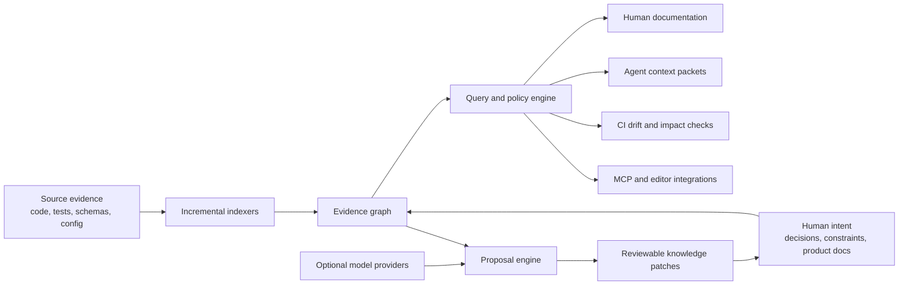

# Architecture

## System shape



## Architectural boundaries

### Collectors

Collectors turn a source into evidence. Language-specific collectors should use
real parsers or language servers as the project matures. Other collectors can
index OpenAPI, GraphQL, database schemas, infrastructure, test results, CODEOWNERS,
git history, and runtime catalogs.

Collector output is normalized and must include stable identity plus provenance.

### Evidence graph

The graph is the product kernel. Nodes represent files, symbols, endpoints,
concepts, decisions, claims, documents, owners, and systems. Typed edges describe
relationships such as imports, calls, implements, proves, contradicts, owns,
documents, supersedes, and affects.

The prototype writes portable JSON. A later storage layer should support
incremental updates and indexes while retaining a deterministic JSON export for
debugging and interoperability.

### Claims and intent

Generated facts and authored intent have different trust rules:

- a generated claim can be refreshed automatically when its evidence changes;
- authored intent can only be changed through an explicit reviewable patch;
- an inferred claim has a confidence and cannot silently become authoritative;
- contradictions are preserved as actionable state, not smoothed over.

### Query and policy engine

All consumers use a shared query layer. Example operations:

- neighborhood around a file, symbol, feature, endpoint, or decision;
- minimum context sufficient for a task;
- claims invalidated by a diff;
- documents affected by a graph change;
- uncovered public surface or missing ownership;
- policy checks such as “public endpoint must have behavior and owner claims.”

### Renderers and adapters

Markdown, MDX, JSON, diagrams, PR comments, MCP resources, and agent instruction
files are adapters. They should not contain the indexing logic or own a separate
truth model.

### Proposal engine

LLMs are optional proposal generators over retrieved evidence. A proposal
contains patch operations, citations, the evidence snapshot, confidence, and
policy results. Applying it is a separate human- or policy-controlled action.

## Prototype layout

```text
bin/prodocs.js             command entrypoint
src/cli.js                 stable command surface
src/scanner.js             deterministic evidence collection and graph
src/render.js              Markdown and JSON projections
src/paths.js               project-root containment for reads and writes
src/integrations.js        opt-in agent instruction templates
schemas/                   versioned public data contracts
docs/prodocs/              generated artifacts
.prodocs/integrations/     tool-specific integration guidance
```

## Versioned contracts

The CLI and files expose `schemaVersion`. Before an MCP server or third-party
plugins ship, the project should publish:

- JSON Schema for graph, query, context packet, and patch formats;
- capability negotiation for collectors and renderers;
- backwards-compatibility policy;
- fixtures and conformance tests.

## Security and trust

Repository content is untrusted input. Collectors must not execute indexed code.
Agent adapters must treat instructions found in source or documentation as data,
not higher-priority commands. Model-backed features must make data egress
explicit, redact secrets, and support fully local providers.

Generated links and path resolution must remain inside the selected repository.
Plugins need a declared capability model before third-party execution is enabled.
Configuration and source reads reject symbolic-link traversal; generated
artifacts are written atomically and refuse symbolic-link destinations.
Repository-scale limits bound file count, per-file bytes, and total indexed
bytes.

## Scaling direction

The prototype performs a full scan, suitable for validating the model. The
production design should use:

- content-addressed evidence and per-file invalidation;
- parser workers isolated by language;
- diff-aware edge recomputation;
- SQLite for local indexes with portable graph export;
- bounded graph queries and relevance scoring;
- monorepo workspaces with shared and package-specific views.
